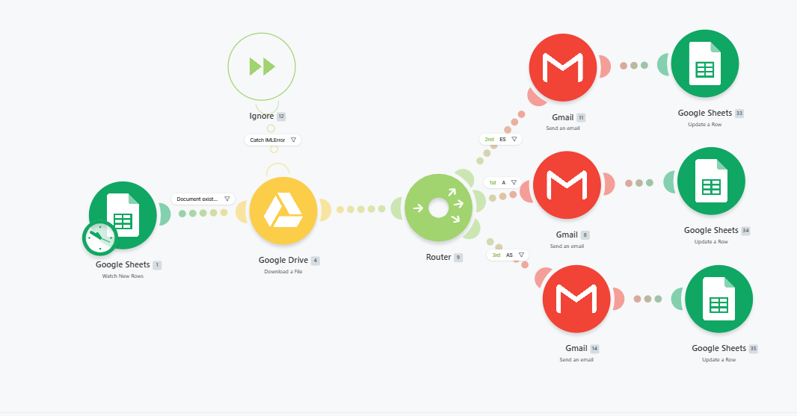

# Make - Emails Automation Flow

This repository contains a Make automation scenario for sending new email requests from a Google Sheet every morning and marking them as sent.

## Flow Overview

1. Google Sheets: Watch new rows in the sheet.
2. Google Drive: Download a document if the row contains an existing file reference.
3. Router: Branch the scenario into separate email paths.
4. Gmail: Send an email for each route.
5. Google Sheets: Update the original row after email send, marking it as sent and adding a timestamp.
6. Error handling: Catch `IMLError` events and ignore them so the scenario continues.

## What the scenario does

- Detects new rows in a Google Sheet.
- Optionally downloads a linked document from Google Drive.
- Routes the data through different Gmail email actions.
- After sending each message, updates the sheet row to record completion.

## Files

- `README.md` — project description and usage notes.
- `Emails_Automation.png` — the Make scenario diagram.

## Diagram

## Google Sheet columns

The scenario expects the sheet to use these headers in row 1:

- `Email` — recipient email address
- `Puesto` — job title or position
- `Empresa` — company name
- `Versión` — version code or language variant
- `CV_Link` — reference ID or document link for the CV file
- `Status` — current status, e.g. `Enviado`
- `Fecha` — sent date/time stamp
- `Detalle` — details such as language and format
- `Links` — file or document links used for sending

### Sample row

| Email | Puesto | Empresa | Versión | CV_Link | Status | Fecha | Detalle | Links |
|---|---|---|---|---|---|---|---|---|
| arellano.a.arturo@gmail.com | Test | Test for main | A | 1AaEGXlot9 | Enviado | 2026-05-13 09:00 | A - Datos inglés | 1AaEGXl |

### How the scenario updates the sheet

- The flow reads new rows where `Status` is not yet `Enviado`.
- After sending the email, it writes `Enviado` into the `Status` column.
- It also writes the current timestamp into the `Fecha` column.

## Notes

- This is a shared Make scenario for `Make.com`.
- Use the public scenario link to import the flow into your Make account.

Shared scenario:
https://us2.make.com/public/shared-scenario/ONj8crDlCjB/envio-de-cvs
